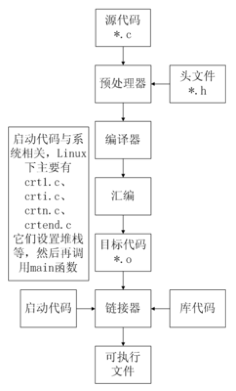

## C语言特点

### 优点

1. 代码量小

2. 执行速度快

3. 功能强大

4. 编程自由

 

### 缺点

1. 写代码实现周期长

2. 可移植性较差

3. 过于自由，经验不足易出错

4. 对平台库依赖较多


## C语言的简洁性

### C语言32个关键字

| auto     | 声明自动变量                                                 |
| -------- | ------------------------------------------------------------ |
| break    | 跳出当前循环                                                 |
| case     | 开关语句分支                                                 |
| char     | 声明字符型变量或函数返回值类型                               |
| const    | 定义常量，如果一个变量被 const 修饰，那么它的值就不能再被改变 |
| continue | 结束当前循环，开始下一轮循环                                 |
| default  | 开关语句中的"其它"分支                                       |
| do       | 循环语句的循环体                                             |
| double   | 声明双精度浮点型变量或函数返回值类型                         |
| else     | 条件语句否定分支（与 if 连用）                               |
| enum     | 声明枚举类型                                                 |
| extern   | 声明变量或函数是在其它文件或本文件的其他位置定义             |
| float    | 声明浮点型变量或函数返回值类型                               |
| for      | 一种循环语句                                                 |
| goto     | 无条件跳转语句                                               |
| if       | 条件语句                                                     |
| int      | 声明整型变量或函数                                           |
| long     | 声明长整型变量或函数返回值类型                               |
| register | 声明寄存器变量                                               |
| return   | 子程序返回语句（可以带参数，也可不带参数）                   |
| short    | 声明短整型变量或函数                                         |
| signed   | 声明有符号类型变量或函数                                     |
| sizeof   | 计算数据类型或变量长度（即所占字节数）                       |
| static   | 声明静态变量                                                 |
| struct   | 声明结构体类型                                               |
| switch   | 用于开关语句                                                 |
| typedef  | 用以给数据类型取别名                                         |
| unsigned | 声明无符号类型变量或函数                                     |
| union    | 声明共用体类型                                               |
| void     | 声明函数无返回值或无参数，声明无类型指针                     |
| volatile | 说明变量在程序执行中可被隐含地改变                           |
| while    | 循环语句的循环条件                                           |

### C99 新增关键字

| `_Bool` | `_Complex` | `_Imaginary` | `inline` | `restrict` |
| ------- | ---------- | ------------ | -------- | ---------- |
|         |            |              |          |            |

### C11 新增关键字

| `_Alignas`       | `_Alignof`      | `_Atomic` | `_Generic` | `_Noreturn` |
| ---------------- | --------------- | --------- | ---------- | ----------- |
| `_Static_assert` | `_Thread_local` |           |            |             |

 ### 9种控制语句


 ### 34种运算符


## 数据类型

在 C 语言中，数据类型指的是用于声明不同类型的变量或函数的一个广泛的系统。变量的类型决定了变量存储占用的空间，以及如何解释存储的位模式。

C 中的类型可分为以下几种：

| 序号 | 类型与描述                                                   |
| :--- | :----------------------------------------------------------- |
| 1    | **基本类型：** 它们是算术类型，包括两种类型：整数类型和浮点类型。 |
| 2    | **枚举类型：** 它们也是算术类型，被用来定义在程序中只能赋予其一定的离散整数值的变量。 |
| 3    | **void 类型：** 类型说明符 *void* 表明没有可用的值。         |
| 4    | **派生类型：** 它们包括：指针类型、数组类型、结构类型、共用体类型和函数类型。 |


## 整数类型

下表列出了关于标准整数类型的存储大小和值范围的细节：

| 类型           | 存储大小    | 值范围                                               |
| :------------- | :---------- | :--------------------------------------------------- |
| char           | 1 字节      | -128 到 127 或 0 到 255                              |
| unsigned char  | 1 字节      | 0 到 255                                             |
| signed char    | 1 字节      | -128 到 127                                          |
| int            | 2 或 4 字节 | -32,768 到 32,767 或 -2,147,483,648 到 2,147,483,647 |
| unsigned int   | 2 或 4 字节 | 0 到 65,535 或 0 到 4,294,967,295                    |
| short          | 2 字节      | -32,768 到 32,767                                    |
| unsigned short | 2 字节      | 0 到 65,535                                          |
| long           | 4 字节      | -2,147,483,648 到 2,147,483,647                      |
| unsigned long  | 4 字节      | 0 到 4,294,967,295                                   |

> 注意，各种类型的存储大小与系统位数有关，但目前通用的以64位系统为主。
>
> 以下列出了32位系统与64位系统的存储大小的差别（windows 相同）：
>
> 

为了得到某个类型或某个变量在特定平台上的准确大小，您可以使用 **sizeof** 运算符。表达式 *sizeof(type)* 得到对象或类型的存储字节大小。

## 浮点类型

下表列出了关于标准浮点类型的存储大小、值范围和精度的细节：

| 类型        | 存储大小 | 值范围                 | 精度      |
| :---------- | :------- | :--------------------- | :-------- |
| float       | 4 字节   | 1.2E-38 到 3.4E+38     | 6 位小数  |
| double      | 8 字节   | 2.3E-308 到 1.7E+308   | 15 位小数 |
| long double | 16 字节  | 3.4E-4932 到 1.1E+4932 | 19 位小数 |

## void 类型

void 类型指定没有可用的值。它通常用于以下三种情况下：

| 序号 | 类型与描述                                                   |
| :--- | :----------------------------------------------------------- |
| 1    | **函数返回为空** C 中有各种函数都不返回值，或者您可以说它们返回空。不返回值的函数的返回类型为空。例如 **void exit (int status);** |
| 2    | **函数参数为空** C 中有各种函数不接受任何参数。不带参数的函数可以接受一个 void。例如 **int rand(void);** |
| 3    | **指针指向 void** 类型为 void * 的指针代表对象的地址，而不是类型。例如，内存分配函数 **void \*malloc( size_t size );** 返回指向 void 的指针，可以转换为任何数据类型。 |

## 头文件

### \#include< > 与 #include " "的区别：

<  > 表示系统直接按系统指定的目录检索

" " 表示系统先在 "" 指定的路径(没写路径代表当前路径)查找头文件，如果找不到，再按系统指定的目录检索


### extern

如果需要在一个源文件中引用另外一个源文件中定义的变量，我们只需在引用的文件中将变量加上 extern 关键字的声明即可。

## 左值（Lvalues）和右值（Rvalues）

C 中有两种类型的表达式：

1. **左值（lvalue）：**指向内存位置的表达式被称为左值（lvalue）表达式。左值可以出现在赋值号的左边或右边。
2. **右值（rvalue）：**术语右值（rvalue）指的是存储在内存中某些地址的数值。右值是不能对其进行赋值的表达式，也就是说，右值可以出现在赋值号的右边，但不能出现在赋值号的左边。

变量是左值，因此可以出现在赋值号的左边。数值型的字面值是右值，因此不能被赋值，不能出现在赋值号的左边。下面是一个有效的语句：

```
int g = 20;
```


## C程序编译步骤

C代码编译成可执行程序经过4步：

1）预处理：宏定义展开、头文件展开、条件编译等，同时将代码中的注释删除，这里并不会检查语法

2）编译：检查语法，将预处理后文件编译生成汇编文件

3）汇编：将汇编文件生成目标文件(二进制文件)

4）链接：C语言写的程序是需要依赖各种库的，所以编译之后还需要把库链接到最终的可执行程序中去



## 寄存器、缓存、内存三者关系

按与CPU远近来分，离得最近的是寄存器，然后缓存(CPU缓存)，最后内存。

CPU计算时，先预先把要用的数据从硬盘读到内存，然后再把即将要用的数据读到寄存器。于是 CPU<--->寄存器<--->内存，这就是它们之间的信息交换。

那为什么有缓存呢？因为如果老是操作内存中的同一址地的数据，就会影响速度。于是就在寄存器与内存之间设置一个缓存。

因为从缓存提取的速度远高于内存。当然缓存的价格肯定远远高于内存，不然的话，机器里就没有内存的存在。

由此可以看出，从远近来看：CPU〈---〉寄存器〈---> 缓存 <---> 内存。


## 二进制

二进制是计算技术中广泛采用的一种数制。二进制数据是用0和1两个数码来表示的数。它的基数为2，进位规则是“逢二进一”，借位规则是“借一当二”。

当前的计算机系统使用的基本上是二进制系统，数据在计算机中主要是以补码的形式存储的。 

| **术语**     | **含义**                                                     |
| ------------ | ------------------------------------------------------------ |
| bit(比特)    | 一个二进制代表一位，一个位只能表示0或1两种状态。数据传输是习惯以“位”（bit）为单位。 |
| Byte(字节)   | 一个字节为8个二进制，称为8位，计算机中存储的最小单位是字节。数据存储是习惯以“字节”（Byte）为单位。 |
| WORD(双字节) | 2个字节，16位                                                |
| DWORD        | 两个WORD，4个字节，32位                                      |
| 1b           | 1bit，1位                                                    |
| 1B           | 1Byte,1字节，8位                                             |
| 1k，1K       | 1024                                                         |
| 1M(1兆)      | 1024k, 1024*1024                                             |
| 1G           | 1024M                                                        |
| 1T           | 1024G                                                        |
| 1Kb(千位)    | 1024bit,1024位                                               |
| 1KB(千字节)  | 1024Byte，1024字节                                           |
| 1Mb(兆位)    | 1024Kb = 1024 * 1024bit                                      |
| 1MB(兆字节)  | 1024KB = 1024 * 1024Byte                                     |