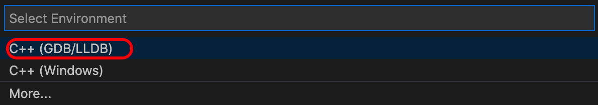

# macbook配置vs code+Makefile

## 步骤一：添加launch.json文件

按F5运行，会弹出如下选择框：



接着编辑launch.json文件，如下：

```c++
{
    // Use IntelliSense to learn about possible attributes.
    // Hover to view descriptions of existing attributes.
    // For more information, visit: https://go.microsoft.com/fwlink/?linkid=830387
    "version": "0.2.0",
    "configurations": [
        {
            "name": "(lldb) Launch",
            "type": "cppdbg",
            "request": "launch",
            "program": "${workspaceRoot}/hello_world",
            "args": [],
            "stopAtEntry": false,
            "cwd": ".",
            "environment": [],
            "externalConsole": false,
            "MIMode": "lldb"
        }
    ]
}
```

组合键command+shift+B编译，再按F5即可运行

## 步骤二:添加tasks.json


